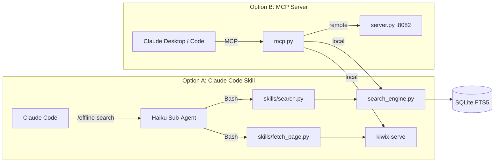

# Offline Search for MCP & Claude Code

A **drop-in replacement** for `google_search` and `visit_page` tools — designed for air-gapped environments where the AI agent has no internet access.

It indexes [Kiwix](https://kiwix.org/) ZIM archives (offline Wikipedia, Stack Overflow, Python docs, DevDocs, etc.) into a local SQLite FTS5 database, then exposes them as tools via:

- **MCP** (Model Context Protocol) — for Claude Desktop
- **Claude Code skill** — for the Claude Code CLI
- **HTTP API** — for distributed / multi-machine deployments

<p align="center">
  
</p>



## Features

- **Offline first** — works in fully air-gapped environments
- **Dual tools** — `google_search` for search + `visit_page` to read full content
- **Smart ranking** — BM25 with title boosting, synonym expansion, prefix matching, and non-English demotion
- **Distributed ready** — run the heavy ZIM server centrally, connect lightweight clients over the network
- **Zero-downtime ZIM updates** — ingest new ZIM versions while old content continues serving; atomic swap when done
- **Catalog client** — check the Kiwix OPDS catalog for updates, download with SHA-256 verification, push to server or sneakernet
- **Secure ZIM management** — API key auth on mutation endpoints, magic byte validation, configurable size limits
- **Content management API** — index custom HTML pages, crawl internal sites, manage the index via REST
- **Extensible** — inject content from Confluence, Artifactory, or any other source
- **Token-efficient** — Haiku sub-agent summarises raw results before returning to main model; optional compact format reduces MCP output tokens

## Quick Start

### 1. Install

```bash
# Install uv if you don't have it (https://docs.astral.sh/uv/)
curl -LsSf https://astral.sh/uv/install.sh | sh

# Install the project and all dependencies
uv sync --all-extras
```

<details>
<summary>Alternative: pip</summary>

```bash
python -m venv .venv && source .venv/bin/activate
pip install -e ".[dev]"
```
</details>

### 2. Set up ZIM library

The setup script handles everything — downloads kiwix-tools for your platform,
fetches ZIM documentation archives, builds the library catalog, and creates the
search index:

```bash
# Full setup with specific docs (comma-separated topics)
bash skills/setup/scripts/setup.sh --zims "python,javascript,bash"

# Just install kiwix-tools (download ZIMs separately later)
bash skills/setup/scripts/setup.sh --kiwix-only

# Rebuild the index after manually adding ZIMs to data/zims/
bash skills/setup/scripts/setup.sh --index-only
```

To browse available ZIMs before choosing:

```bash
uv run offline-search-catalog search python
uv run offline-search-catalog search react
```

<details>
<summary>Manual setup (step by step)</summary>

#### Download Kiwix Tools

Download from [download.kiwix.org/release/kiwix-tools/](https://download.kiwix.org/release/kiwix-tools/):

| OS | File to download |
|----|-----------------|
| Windows 64-bit | `kiwix-tools_win-x86_64-*.zip` |
| Linux x86_64 | `kiwix-tools_linux-x86_64-*.tar.gz` |
| macOS x86_64 | `kiwix-tools_macos-x86_64-*.tar.gz` |
| macOS ARM (Apple Silicon) | `kiwix-tools_macos-arm64-*.tar.gz` |

Extract and place `kiwix-serve` + `kiwix-manage` in `bin/` or on your PATH.

#### Download ZIM files

Browse [download.kiwix.org/zim/](https://download.kiwix.org/zim/) and place ZIM files in `data/zims/`.

#### Build library.xml and index

```bash
kiwix-manage data/library.xml add data/zims/your-file.zim
offline-search-index --library data/library.xml --output data/offline_index.sqlite
```
</details>

### 2b. Crawl any website (optional)

Don't see a pre-built ZIM for the docs you need? Use the **zimit skill** to crawl
any website and package it as a ZIM — requires [Docker](https://docs.docker.com/get-docker/).

**Example: make the Claude Code docs searchable offline**

```bash
bash skills/zimit/scripts/zimit.sh https://code.claude.com/docs \
  --name claude_code_docs --limit 10 --ingest
```

This crawls the site (using a real browser via [Zimit](https://github.com/openzim/zimit)),
creates a ZIM archive, and ingests it into the search index — all in one command.
Even with `--limit 10`, Next.js sites like this one load content for all pages via
React Server Components, so the full docs end up indexed (239 articles in this case).

```bash
# Verify it works
uv run python skills/offline-search/scripts/search.py "claude code hooks"
# → returns results from the offline Claude Code docs
```

Other good candidates: internal wikis, Confluence spaces, Docusaurus sites,
API docs — anything with a URL.

### 3. Use with Claude Code (Recommended)

**Option A: Install skills with npx** (easiest)

```bash
npx skills add ArielIL/offline-web-search
```

This installs both the `offline-search` skill (for searching docs) and the
`setup` skill (for managing ZIM libraries) into your Claude Code environment.

**Option B: Skill** (manual install, no background server needed)

```bash
./scripts/install_claude_code.sh skill     # Linux/macOS
.\scripts\install_claude_code.ps1 skill    # Windows
```

This copies the skill to `~/.claude/skills/offline-search/`. Claude Code will auto-trigger it when it needs to search documentation, or you can invoke it directly with `/offline-search <query>`.

**Option B: MCP server**

```bash
./scripts/install_claude_code.sh mcp       # Linux/macOS
.\scripts\install_claude_code.ps1 mcp      # Windows
```

Registers an MCP server that exposes `google_search` and `visit_page` tools.

### 4. Use with Claude Desktop

Add to `%APPDATA%\Claude\claude_desktop_config.json`:

```json
{
  "mcpServers": {
    "offline-search": {
      "command": "python",
      "args": ["-m", "offline_search.mcp"]
    }
  }
}
```

For detailed deployment instructions (including distributed mode), see [DEPLOYMENT.md](DEPLOYMENT.md).

## Project Structure

```
src/offline_search/
├── config.py          # Centralised settings (env vars, .env, defaults)
├── search_engine.py   # Core FTS5 search: tokeniser, BM25, ranking, filtering
├── formatter.py       # Result formatting (standard + compact output modes)
├── kiwix.py           # Kiwix-serve lifecycle (start/stop/restart) + page fetching
├── indexer.py         # ZIM → SQLite indexer (CLI: offline-search-index)
├── mcp.py             # Unified MCP server — auto-detects local/remote mode
├── server.py          # FastAPI HTTP API + content management + ZIM upload
├── updater.py         # Server-side ZIM management — zero-downtime ingest pipeline
└── catalog.py         # Online Kiwix catalog client — check/download/push updates

.claude/agents/
└── offline-search-agent.md  # Haiku sub-agent for token-efficient search

skills/
├── offline-search/    # Search skill (routes through Haiku sub-agent)
│   ├── SKILL.md
│   └── scripts/
│       ├── search.py      # CLI: search the index
│       └── fetch_page.py  # CLI: fetch a page as Markdown
├── setup/             # Setup skill (install kiwix-tools, download ZIMs, build index)
│   ├── SKILL.md
│   └── scripts/
│       └── setup.sh
└── zimit/             # Zimit skill (crawl websites → ZIM archives)
    ├── SKILL.md
    └── scripts/
        └── zimit.sh

tests/                 # pytest test suite
scripts/               # Installation helpers (skill or MCP)
```

## MCP Tools

| Tool | Description |
|------|-------------|
| `google_search(query)` | Full-text search across the offline library. Named to match the built-in web search tool for seamless drop-in. |
| `visit_page(url)` | Fetch and read the full content of a page (returns clean Markdown). |

## HTTP API Endpoints

When running the server (`offline-search-server`):

| Method | Endpoint | Auth | Description |
|--------|----------|------|-------------|
| `GET` | `/search?q=...&limit=10&zim=...` | No | Full-text search |
| `GET` | `/health` | No | Health check + index stats |
| `GET` | `/stats` | No | Detailed index statistics |
| `POST` | `/index/page` | No | Index a single HTML/text page |
| `POST` | `/index/crawl` | No | Crawl and index a website |
| `DELETE` | `/index?url=...` | No | Remove a document by URL |
| `GET` | `/zim/list` | No | List installed ZIMs with versions |
| `GET` | `/zim/manifest` | No | Export JSON manifest of installed ZIMs |
| `POST` | `/zim/upload` | Yes | Upload a ZIM file (validates + zero-downtime ingest) |
| `POST` | `/zim/ingest` | Yes | Ingest a ZIM file already on disk |
| `DELETE` | `/zim/{filename}` | Yes | Remove a ZIM from library + index + disk |

**Auth**: Endpoints marked "Yes" require `Authorization: Bearer <key>` header. Set `OFFLINE_SEARCH_API_KEY` to enable; if unset, mutation endpoints return 403 (fail-closed).

## Configuration

All settings support environment variable overrides (prefix: `OFFLINE_SEARCH_`):

| Variable | Default | Description |
|----------|---------|-------------|
| `OFFLINE_SEARCH_MODE` | auto-detect | `local` or `remote` (auto-detects from `REMOTE_HOST`) |
| `OFFLINE_SEARCH_DB_PATH` | `data/offline_index.sqlite` | FTS5 index path |
| `OFFLINE_SEARCH_KIWIX_PORT` | `8081` | Kiwix-serve port |
| `OFFLINE_SEARCH_SERVER_PORT` | `8082` | HTTP API port |
| `OFFLINE_SEARCH_REMOTE_HOST` | `127.0.0.1` | Server IP for remote mode |
| `OFFLINE_SEARCH_COMPACT_FORMAT` | `false` | Use compact output for MCP tools (reduces tokens) |
| `OFFLINE_SEARCH_ZIM_DIR` | `{base_dir}/zims` | ZIM file storage directory |
| `OFFLINE_SEARCH_KIWIX_MANAGE` | auto-detect | Path to kiwix-manage binary |
| `OFFLINE_SEARCH_UPLOAD_MAX_SIZE_GB` | `20` | Max ZIM upload size |
| `OFFLINE_SEARCH_CATALOG_URL` | `https://library.kiwix.org/catalog/search` | Kiwix OPDS catalog endpoint |
| `OFFLINE_SEARCH_MANIFEST_PATH` | `{base_dir}/data/zim_manifest.json` | Manifest file path |
| `OFFLINE_SEARCH_API_KEY` | `""` (empty = disabled) | API key for `/zim/*` mutation endpoints |

Or create a `.env` file at the project root.

## ZIM Update Management

Offline Search provides a complete pipeline for keeping ZIM files up to date, from fully manual (sneakernet) to fully automated.

### Zero-Downtime Updates

When ingesting a new version of a ZIM, the old content **continues serving searches** while the new version is being indexed. Once indexing completes, old rows are atomically removed — no downtime window.

```bash
# Server-side: ingest a new ZIM (auto-detects and replaces older version)
offline-search-update ingest devdocs_en_python_2026-03.zim

# List installed ZIMs
offline-search-update list

# Export a manifest for the catalog client
offline-search-update manifest --output /usb/manifest.json
```

### Catalog Client

The catalog client runs on an **internet-connected machine** to check for updates:

```bash
# Check what's available vs. what's installed
offline-search-catalog check --manifest /usb/manifest.json

# Search the Kiwix catalog
offline-search-catalog search python

# Download a specific ZIM
offline-search-catalog download devdocs_en_python --dest /usb/

# Download all updates and push to the air-gapped server
offline-search-catalog update --push http://server:8082 --api-key $KEY

# Watch mode: check every 24h, auto-download, notify via Slack
offline-search-catalog watch --auto-download --auto-push http://srv:8082 \
    --api-key $KEY --notify-command "curl -X POST slack.webhook"
```

### Update Strategies

| Strategy | Setup | Security |
|----------|-------|----------|
| **Sneakernet** | `catalog download` → USB → `update ingest` | Highest — no network path |
| **Semi-automated** | `watch --auto-download --notify-command send-email.sh` | Human reviews before transfer |
| **Fully automated** | `watch --auto-download --auto-push` | Convenient; API key required |

## Testing

```bash
uv run pytest tests/ -v
uv run pytest tests/ --cov=offline_search --cov-report=term-missing
```

## Requirements

- Python 3.11+
- [Kiwix Tools](https://download.kiwix.org/release/kiwix-tools/) (`kiwix-serve` binary)
- ZIM archives (from [download.kiwix.org/zim/](https://download.kiwix.org/zim/))
