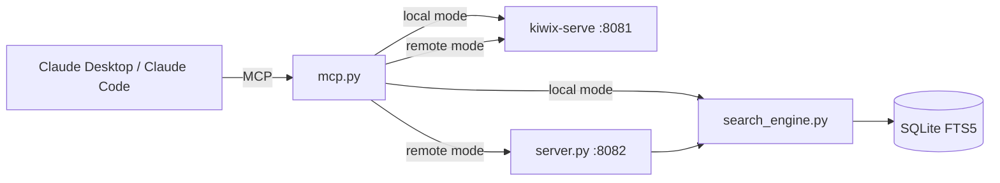

# Offline Search for MCP & Claude Code

A **drop-in replacement** for `google_search` and `visit_page` tools — designed for air-gapped environments where the AI agent has no internet access.

It indexes [Kiwix](https://kiwix.org/) ZIM archives (offline Wikipedia, Stack Overflow, Python docs, DevDocs, etc.) into a local SQLite FTS5 database, then exposes them as tools via:

- **MCP** (Model Context Protocol) — for Claude Desktop
- **Claude Code skill** — for the Claude Code CLI
- **HTTP API** — for distributed / multi-machine deployments



## Features

- **Offline first** — works in fully air-gapped environments
- **Dual tools** — `google_search` for search + `visit_page` to read full content
- **Smart ranking** — BM25 with title boosting, synonym expansion, prefix matching, and non-English demotion
- **Distributed ready** — run the heavy ZIM server centrally, connect lightweight clients over the network
- **Content management API** — index custom HTML pages, crawl internal sites, manage the index via REST
- **Extensible** — inject content from Confluence, Artifactory, or any other source

## Quick Start

### 1. Install

```bash
pip install -e ".[dev]"
```

### 2. Build the Index

```bash
offline-search-index --library path/to/library.xml --output data/offline_index.sqlite
```

### 3. Use with Claude Code (Recommended)

```bash
# Register as a Claude Code skill
./scripts/install_claude_code.sh     # Linux/macOS
.\scripts\install_claude_code.ps1    # Windows
```

Then start Claude Code anywhere — it will have `google_search` and `visit_page` tools available.

### 4. Use with Claude Desktop

Add to `%APPDATA%\Claude\claude_desktop_config.json`:

```json
{
  "mcpServers": {
    "offline-search": {
      "command": "python",
      "args": ["-m", "offline_search.mcp"]
    }
  }
}
```

For detailed deployment instructions (including distributed mode), see [DEPLOYMENT.md](DEPLOYMENT.md).

## Project Structure

```
src/offline_search/
├── config.py          # Centralised settings (env vars, .env, defaults)
├── search_engine.py   # Core FTS5 search: tokeniser, BM25, ranking, filtering
├── kiwix.py           # Kiwix-serve lifecycle + page fetching → Markdown
├── indexer.py         # ZIM → SQLite indexer (CLI: offline-search-index)
├── mcp.py             # Unified MCP server — auto-detects local/remote mode
└── server.py          # FastAPI HTTP API + content management endpoints

tests/                 # pytest test suite
scripts/               # Installation helpers for Claude Code
```

## MCP Tools

| Tool | Description |
|------|-------------|
| `google_search(query)` | Full-text search across the offline library. Named to match the built-in web search tool for seamless drop-in. |
| `visit_page(url)` | Fetch and read the full content of a page (returns clean Markdown). |

## HTTP API Endpoints

When running the server (`offline-search-server`):

| Method | Endpoint | Description |
|--------|----------|-------------|
| `GET` | `/search?q=...&limit=10&zim=...` | Full-text search |
| `GET` | `/health` | Health check + index stats |
| `GET` | `/stats` | Detailed index statistics |
| `POST` | `/index/page` | Index a single HTML/text page |
| `POST` | `/index/crawl` | Crawl and index a website |
| `DELETE` | `/index?url=...` | Remove a document by URL |

## Configuration

All settings support environment variable overrides (prefix: `OFFLINE_SEARCH_`):

| Variable | Default | Description |
|----------|---------|-------------|
| `OFFLINE_SEARCH_MODE` | auto-detect | `local` or `remote` (auto-detects from `REMOTE_HOST`) |
| `OFFLINE_SEARCH_DB_PATH` | `data/offline_index.sqlite` | FTS5 index path |
| `OFFLINE_SEARCH_KIWIX_PORT` | `8081` | Kiwix-serve port |
| `OFFLINE_SEARCH_SERVER_PORT` | `8082` | HTTP API port |
| `OFFLINE_SEARCH_REMOTE_HOST` | `127.0.0.1` | Server IP for remote mode |

Or create a `.env` file at the project root.

## Testing

```bash
pytest tests/ -v
pytest tests/ --cov=offline_search --cov-report=term-missing
```

## Requirements

- Python 3.11+
- [Kiwix Tools](https://download.kiwix.org/release/kiwix-tools/) (`kiwix-serve` binary)
- ZIM archives (from [download.kiwix.org/zim/](https://download.kiwix.org/zim/))
