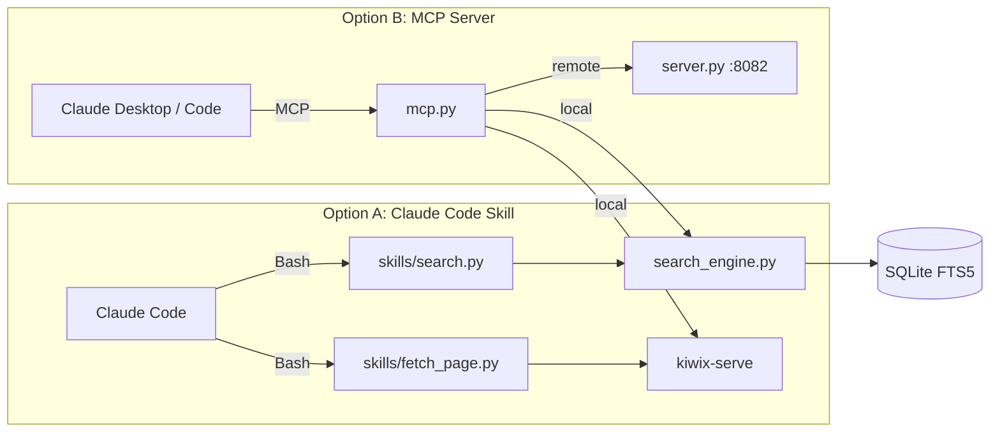

# Offline Search for MCP & Claude Code

A **drop-in replacement** for `google_search` and `visit_page` tools — designed for air-gapped environments where the AI agent has no internet access.

It indexes [Kiwix](https://kiwix.org/) ZIM archives (offline Wikipedia, Stack Overflow, Python docs, DevDocs, etc.) into a local SQLite FTS5 database, then exposes them as tools via:

- **MCP** (Model Context Protocol) — for Claude Desktop
- **Claude Code skill** — for the Claude Code CLI
- **HTTP API** — for distributed / multi-machine deployments



## Features

- **Offline first** — works in fully air-gapped environments
- **Dual tools** — `google_search` for search + `visit_page` to read full content
- **Smart ranking** — BM25 with title boosting, synonym expansion, prefix matching, and non-English demotion
- **Distributed ready** — run the heavy ZIM server centrally, connect lightweight clients over the network
- **Content management API** — index custom HTML pages, crawl internal sites, manage the index via REST
- **Extensible** — inject content from Confluence, Artifactory, or any other source
- **Token-efficient** — Haiku sub-agent summarizes results before returning them, plus an optional compact MCP output format

## Quick Start

### 1. Install

```bash
pip install -e ".[dev]"
```

### 2. Prepare your ZIM library

Offline Search uses **ZIM archives** — compact offline snapshots of websites —
as its content source.  Four sub-steps:

#### 2a. Download Kiwix Tools

Kiwix Tools provides two binaries you need: `kiwix-serve` (the content server)
and `kiwix-manage` (the library catalog manager).

Download the appropriate package for your OS from
[download.kiwix.org/release/kiwix-tools/](https://download.kiwix.org/release/kiwix-tools/):

| OS | File to download |
|----|-----------------|
| Windows 64-bit | `kiwix-tools_win-x86_64-*.zip` |
| Linux x86_64 | `kiwix-tools_linux-x86_64-*.tar.gz` |
| macOS | `kiwix-tools_macos-x86_64-*.tar.gz` |

Extract the archive and either:
- **Add the folder to your PATH**, or
- **Place it at `kiwix-tools/`** next to this repo — the tool auto-detects it there

#### 2b. Download ZIM files

Browse and download from [download.kiwix.org/zim/](https://download.kiwix.org/zim/):

| Content | Download path |
|---------|---------------|
| Python docs | `zim/devdocs/devdocs_en_python_*.zim` |
| JavaScript docs | `zim/devdocs/devdocs_en_javascript_*.zim` |
| Stack Overflow | `zim/stack_exchange/stackoverflow.com_en_all_*.zim` |
| Wikipedia (compact) | `zim/wikipedia/wikipedia_en_all_mini_*.zim` |
| Many more… | `zim/devdocs/`, `zim/stack_exchange/`, … |

Place ZIM files anywhere on disk — a `zims/` folder next to this repo works
well, but an external drive or network share is fine too.

#### 2c. Build `library.xml`

`library.xml` is a catalog that tells offline-search (and kiwix-serve) which
ZIM archives you have.  Use the included helper script to scan your ZIM folder
and register everything at once:

```bash
# Linux / macOS
./scripts/build_library.sh ~/zims

# Windows (PowerShell)
.\scripts\build_library.ps1 C:\zims
```

Or add individual files by hand if you prefer:

```bash
kiwix-manage library.xml add path/to/python-docs.zim
```

`library.xml` is **machine-specific** (it contains your local file paths) and
is listed in `.gitignore` — never commit it.

> **Reference:** [`library.xml.example`](library.xml.example) shows the XML
> format in full if you ever need to inspect or edit the file by hand.

#### 2d. Build the SQLite index

```bash
offline-search-index --library library.xml --output data/offline_index.sqlite
```

Add `--limit 50` for a quick smoke-test (indexes only 50 articles per ZIM).

### 3. Use with Claude Code (Recommended)

**Option A: Skill** (no background server needed)

```bash
./scripts/install_claude_code.sh skill     # Linux/macOS
.\scripts\install_claude_code.ps1 skill    # Windows
```

This copies the skill to `~/.claude/skills/offline-search/`. Claude Code will auto-trigger it when it needs to search documentation, or you can invoke it directly with `/offline-search <query>`.

The skill routes through a **Haiku sub-agent** (`.claude/agents/offline-search-agent.md`) that executes the search, analyzes the raw results, and returns a condensed summary to the main model — saving tokens in your context window.

**Option B: MCP server**

```bash
./scripts/install_claude_code.sh mcp       # Linux/macOS
.\scripts\install_claude_code.ps1 mcp      # Windows
```

Registers an MCP server that exposes `google_search` and `visit_page` tools.

### 4. Use with Claude Desktop

Add to `%APPDATA%\Claude\claude_desktop_config.json`:

```json
{
  "mcpServers": {
    "offline-search": {
      "command": "python",
      "args": ["-m", "offline_search.mcp"]
    }
  }
}
```

For detailed deployment instructions (including distributed mode), see [DEPLOYMENT.md](DEPLOYMENT.md).

## Project Structure

```
src/offline_search/
├── config.py          # Centralised settings (env vars, .env, defaults)
├── search_engine.py   # Core FTS5 search: tokeniser, BM25, ranking, filtering
├── kiwix.py           # Kiwix-serve lifecycle + page fetching → Markdown
├── indexer.py         # ZIM → SQLite indexer (CLI: offline-search-index)
├── mcp.py             # Unified MCP server — auto-detects local/remote mode
└── server.py          # FastAPI HTTP API + content management endpoints

.claude/agents/
└── offline-search-agent.md  # Haiku sub-agent — summarizes search results to save tokens

skills/offline-search/
├── SKILL.md           # Claude Code skill definition (routes through Haiku agent)
└── scripts/
    ├── search.py      # CLI: search the index, print results
    └── fetch_page.py  # CLI: fetch a page, print Markdown

tests/                 # pytest test suite
scripts/               # Installation helpers (skill or MCP)
```

## MCP Tools

| Tool | Description |
|------|-------------|
| `google_search(query)` | Full-text search across the offline library. Named to match the built-in web search tool for seamless drop-in. |
| `visit_page(url)` | Fetch and read the full content of a page (returns clean Markdown). |

## HTTP API Endpoints

When running the server (`offline-search-server`):

| Method | Endpoint | Description |
|--------|----------|-------------|
| `GET` | `/search?q=...&limit=10&zim=...` | Full-text search |
| `GET` | `/health` | Health check + index stats |
| `GET` | `/stats` | Detailed index statistics |
| `POST` | `/index/page` | Index a single HTML/text page |
| `POST` | `/index/crawl` | Crawl and index a website |
| `DELETE` | `/index?url=...` | Remove a document by URL |

## Configuration

All settings support environment variable overrides (prefix: `OFFLINE_SEARCH_`):

| Variable | Default | Description |
|----------|---------|-------------|
| `OFFLINE_SEARCH_MODE` | auto-detect | `local` or `remote` (auto-detects from `REMOTE_HOST`) |
| `OFFLINE_SEARCH_DB_PATH` | `data/offline_index.sqlite` | FTS5 index path |
| `OFFLINE_SEARCH_KIWIX_PORT` | `8081` | Kiwix-serve port |
| `OFFLINE_SEARCH_SERVER_PORT` | `8082` | HTTP API port |
| `OFFLINE_SEARCH_REMOTE_HOST` | `127.0.0.1` | Server IP for remote mode |
| `OFFLINE_SEARCH_COMPACT_FORMAT` | `false` | Emit minimal `{title, url}` JSON + truncated snippets (reduces MCP token usage) |

Or create a `.env` file at the project root.

## Token Optimization

Large search results can consume significant context window space. Two mechanisms help keep token usage low:

### 1. Haiku Sub-Agent (Skill path)

When using the `/offline-search` skill, queries are routed through `.claude/agents/offline-search-agent.md`, which runs on the lightweight **Haiku** model. Haiku executes the search and page fetches in its own context, then returns only a concise summary (titles, URLs, and brief descriptions) to the main model. This mirrors Claude Code's built-in WebFetch pattern.

### 2. Compact Format (MCP path)

Set `OFFLINE_SEARCH_COMPACT_FORMAT=true` to switch MCP tool output to a minimal format:

```bash
OFFLINE_SEARCH_COMPACT_FORMAT=true offline-search-mcp
```

In compact mode, `google_search` returns a JSON array of `{title, url}` objects with single-line truncated snippets instead of full rich output.

## Testing

```bash
pytest tests/ -v
pytest tests/ --cov=offline_search --cov-report=term-missing
```

## Requirements

- Python 3.11+
- [Kiwix Tools](https://download.kiwix.org/release/kiwix-tools/) (`kiwix-serve` binary)
- ZIM archives (from [download.kiwix.org/zim/](https://download.kiwix.org/zim/))
